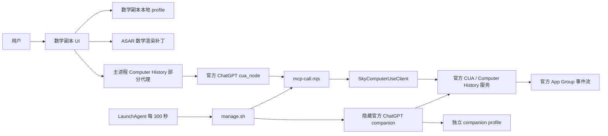

# 当前架构

## 目标

目标原本有两个：

1. 保留最新版 ChatGPT/Codex 桌面客户端的全部新功能。
2. 只为用户消息气泡和注释增加单美元数学公式渲染。

由于本地重签名的数学副本无法天然继承官方签名、Team ID 和 App Group 能力，Computer History 又依赖官方桌面应用和官方 App Group，于是实现演化成双进程方案。

## 组件

### A. 官方 ChatGPT

路径：`/Applications/ChatGPT.app`

职责：

- 提供官方 Computer History 组件。
- 提供官方 `cua_node`。
- 必要时被 companion 以独立 user-data-dir 启动。

### B. 数学副本

路径示例：`/Applications/ChatGPT-Math-26.814.41407-History.app`

职责：

- 日常聊天和学习。
- 使用本地 profile：`~/Library/Application Support/Codex`。
- 通过 ASAR 补丁渲染用户气泡和注释中的数学内容。
- 通过主进程补丁把部分 Computer History 方法转发到外部 MCP 客户端。

### C. History Companion

源码：

- `manage.sh`
- `mcp-call.mjs`
- `history-companion.LaunchAgent.plist`

职责：

- LaunchAgent 每 300 秒执行一次 `manage.sh`。
- `mcp-call.mjs` 启动 `SkyComputerUseClient computer-history mcp`。
- `manage.sh` 查询 history 状态。
- 当状态不可用且不处于手动暂停锁存状态时，用独立 profile 启动官方 ChatGPT。

Companion profile：

`~/Library/Application Support/Codex Math Official Companion Shared Config`

### D. Computer History 原生服务

官方事件目录属于 ChatGPT App Group：

`~/Library/Group Containers/2DC432GLL2.com.openai.sky.CUAService/.../Skysight`

数学副本不直接拥有这个 App Group。当前方案通过官方客户端组件和 SkyComputerUseClient 间接访问。

## 数据流

## 两个 profile 的后果

数学聊天所在 profile：

`~/Library/Application Support/Codex`

隐藏官方 companion profile：

`~/Library/Application Support/Codex Math Official Companion Shared Config`

这两个 profile 不是同一份 Chromium/Electron 用户数据。伴随官方实例不会自然显示数学副本中的本地窗口状态、崩溃数据库和部分本地配置。对话是否完全由本地 profile 隔离还需要受控实验，但当前屏幕现象已经证明两边的可见状态并不等价。

## Computer History 代理并不完整

`build-history-proxy-math.mjs` 只替换以下五个方法：

- `getState`
- `pause`
- `resume`
- `getSettings`
- `updateSettings`

以下方法仍走数学副本原来的本地控制器：

- `retryActivation`
- `setEnabled`
- `listApplications`
- `resolveApplications`
- `listHistory`
- `listHistorySuggestions`
- `listHistorySummaryIntervals`
- `clearHistory`
- 内部 enable、disable、reconcile 与 eligibility 路径

因此同一个设置页面可能同时读取两个不同权威源：部分状态来自官方 MCP，部分列表和动作仍来自数学副本内部控制器。这是当前方案最重要的架构缺陷之一。

## 启动顺序为什么容易出问题

已确认事实：

- 数学副本运行时使用 `~/Library/Application Support/Codex`。
- companion 官方实例使用独立 user-data-dir。
- companion 会启动完整 ChatGPT，而不是一个专用、无 UI、无 app-server 的轻量服务。
- companion 日志出现远程 app-server 409 冲突。
- companion PID 文件当前指向不存在的主进程。
- 伴随 profile 下仍有多批 crashpad 进程。

合理推测：

1. 标准官方 ChatGPT 与数学副本可能竞争同一个默认 user-data-dir 或单实例锁。
2. 数学副本、标准官方实例和隐藏 companion 可能注册相同远程 app-server 身份，导致 409。
3. LaunchAgent 的恢复逻辑可能在 PID 过期后再次启动完整官方实例，留下更多辅助进程。
4. `stopped`、用户主动暂停和异常停止没有可靠区分，导致启动恢复行为与用户预期不一致。

这些推测不能只靠现有日志完全证明。需要在隔离测试账号或可回滚环境中做启动矩阵实验。

